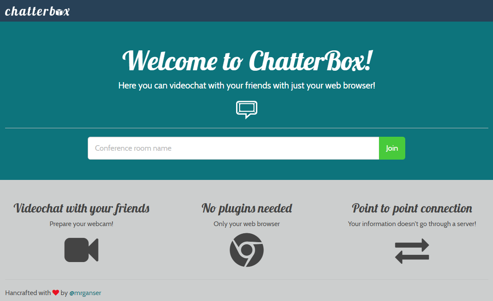
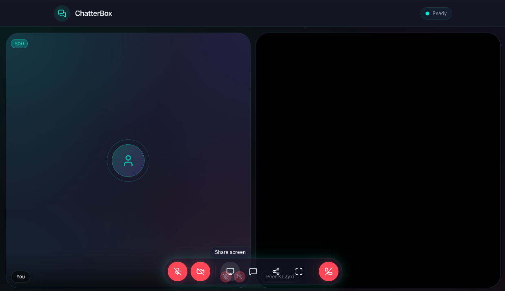

# ChatterBox &middot; [](https://github.com/mrganser/chatterbox/blob/master/LICENSE)

A web application for conference calling using WebRTC technology.

Create a room with a name and share the link with your partners so they can join too.

## Features

- **Video & Audio Conferencing:** Real-time peer-to-peer communication via WebRTC
- **Screen Sharing:** Share your screen with presentation mode layout
- **Text Chat:** In-call messaging with clickable link detection
- **Active Speaker Detection:** Visual glow indicator when participants speak
- **Pre-call Controls:** Set display name and toggle camera/mic before joining
- **Room Sharing:** One-click copy room link to invite others
- **Navigation Guard:** Confirmation prompt to prevent accidental call exit
- **Moderation Tools:** Mute, disable video, or remove participants from the call

## Demo

https://thechatterbox.onrender.com/

- Main page:



- Room:



## Tech Stack

- **Framework:** Next.js 16 + React 19
- **Language:** TypeScript
- **Styling:** Tailwind CSS v4
- **Components:** shadcn/ui
- **Linting/Formatting:** oxlint, oxfmt
- **Testing:** Vitest, React Testing Library
- **Real-time:** WebRTC (peer-to-peer), Socket.IO (signaling)

## Prerequisites

- Node.js >= 18.0.0
- Camera and microphone for video calls
- HTTPS in production (required for WebRTC)

## Getting Started

### Installation

```bash
# Clone the repository
git clone https://github.com/mrganser/chatterbox.git
cd chatterbox

# Install dependencies
npm install
```

### Development

```bash
npm run dev
```

The app will be available at http://localhost:3000

### Production Build

```bash
# Build the app
npm run build

# Start the production server
npm start
```

## Scripts

| Command                 | Description              |
| ----------------------- | ------------------------ |
| `npm run dev`           | Start development server |
| `npm run build`         | Build for production     |
| `npm start`             | Start production server  |
| `npm test`              | Run tests in watch mode  |
| `npm run test:run`      | Run tests once           |
| `npm run test:coverage` | Run tests with coverage  |
| `npm run lint`          | Run linter (oxlint)      |
| `npm run lint:fix`      | Run linter with auto-fix |
| `npm run format`        | Format code (oxfmt)      |
| `npm run format:check`  | Check code formatting    |

## Deployment

This project is ready to deploy to render.com:

1. Set build command: `npm ci --production=false && npm run build && npm prune --production`
2. Set start command: `npm start`

## Authors

- **[mrganser](http://mrganser.com)**

See also the list of [contributors](https://github.com/mrganser/chatterbox/contributors) who participated in this project.

## License

This project is licensed under the MIT License - see the [LICENSE](LICENSE) file for details
