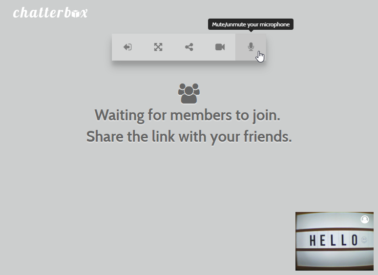

# ChatterBox &middot; [](https://github.com/mrganser/chatterbox/blob/master/LICENSE)

A web application for conference calling using WebRTC technology.

You just need to create a room with a name and share the link with your partners so they can join too.

## Demo

https://chatterbox2.herokuapp.com/

* Main page:


* Waiting for members:



* Conference with myself:


## Getting Started

### Prerequisites

* You need to have a camera and a microphone connected to access a room.

* Don't forget about current WebRTC compatibility. Check out: https://caniuse.com/#search=webrtc

* Minimun engines supported:

```
  "engines": {
    "node": ">=6.0.0",
    "npm": ">=3.8.6"
  }
```

### Installing

* Clone the project

* Install dependencies:

    `npm install`

* Start server @ localhost:5000 by default:

    `npm start`


## Running the tests

Work in progress


## Deployment

This project is ready to deploy to Heroku without any additional configuration.

## Built With

* [Node.js](https://nodejs.org/es/) + [Express.js](http://expressjs.com/) - Web server
* [Socket.IO](https://socket.io/) - Real time communication of peers information
* [WebRTC](https://webrtc.org/) - Technology for conference calling through the browser


## Versioning

We use [SemVer](http://semver.org/) for versioning. For the versions available, see the [tags on this repository](https://github.com/mrganser/chatterbox/tags). 

## Authors

* **[mrganser](http://mrganser.com)**

See also the list of [contributors](https://github.com/mrganser/chatterbox/contributors) who participated in this project.

## License

This project is licensed under the MIT License - see the [LICENSE](LICENSE) file for details
